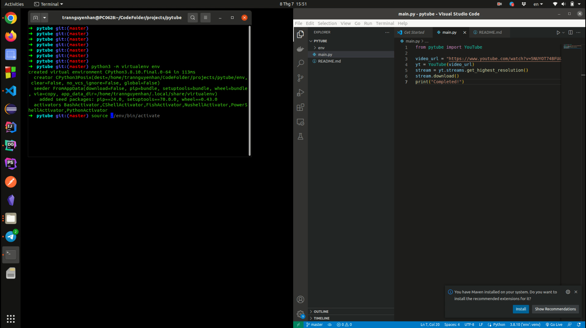

### Setup

Setup virtual enviroment and install libary

```bash
python3 -m virtualenv env
source ./env/bin/activate
pip install pytube
```

### Run project

```bash
python3 main.py
```

### Demo

See demo video in:

[](https://dai.ly/x91q186)

